# Jobsheet 10: Dasar State Management

**Mata Kuliah:** Pemrograman Mobile  
**Jurusan:** Teknologi Informasi, Politeknik Negeri Malang  
**Nama:** Octrian Adiluhung Tito Putra  
**NIM:** 2341720078  
**Kelas:** TI - 3E  
**Absen:** 23  

---

## Praktikum 1: Dasar State dengan Model-View

### Langkah 2: Membuat model task.dart
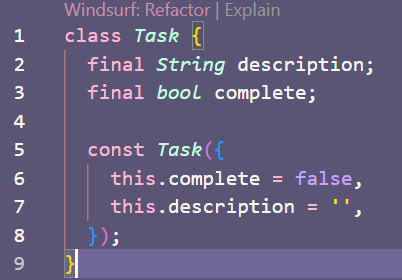

### Langkah 3: Buat file plan.dart
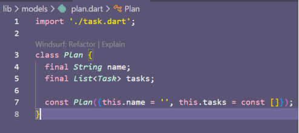

### Langkah 4: Buat file data_layer.dart
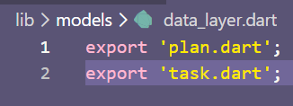

### Langkah 5: Pindah ke file main.dart
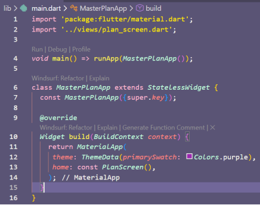

### Langkah 6: Buat plan_screen.dart
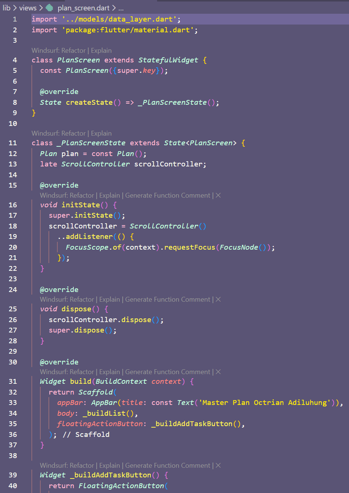

### Langkah 14: Hasil Akhir Praktikum 1
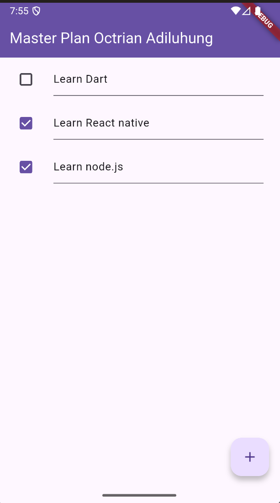

---

## Tugas Praktikum 1

### 1. Selesaikan langkah-langkah praktikum tersebut, lalu dokumentasikan berupa GIF hasil akhir praktikum beserta penjelasannya di file README.md!
**Jawab:** 
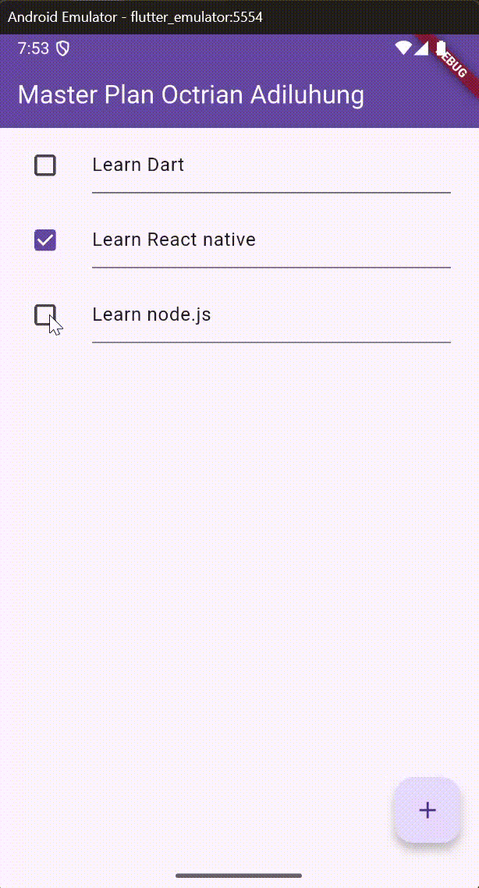 
*Penjelasan: Aplikasi Master Plan sederhana di mana pengguna dapat menambahkan tugas baru (task) melalui tombol tambah, dan menandai tugas yang selesai menggunakan checkbox. State dikelola secara lokal menggunakan `setState`.*

### 2. Jelaskan maksud dari langkah 4 pada praktikum tersebut! Mengapa dilakukan demikian?
**Jawab:** 
Langkah 4 membuat file `data_layer.dart` yang berisi perintah `export 'plan.dart';` dan `export 'task.dart';`.
Tujuannya adalah untuk membungkus (wrapping) beberapa model menjadi satu pintu impor. Hal ini dilakukan agar kode lebih rapi dan efisien. Ketika kita membutuhkan model `Plan` dan `Task` di file lain, kita cukup mengimpor satu file saja (`data_layer.dart`) daripada harus mengimpor kedua file model tersebut secara terpisah.

### 3. Mengapa perlu variabel plan di langkah 6 pada praktikum tersebut? Mengapa dibuat konstanta?
**Jawab:** 
* Variabel `plan` diperlukan sebagai variabel **state** yang menyimpan data rencana (nama dan daftar tugas) yang akan ditampilkan pada layar `PlanScreen`. Tanpa variabel ini, aplikasi tidak memiliki data untuk dirender.
* Variabel tersebut diinisialisasi dengan konstruktor konstanta (`const Plan()`) pada awalnya untuk alasan efisiensi memori dan performa. Karena pada saat inisialisasi awal datanya masih kosong dan belum berubah, Flutter dapat mengoptimalkan objek yang bersifat *immutable* (tidak berubah). Ketika data berubah (user menambah task), kita tidak mengubah objek `const` tersebut, melainkan menggantinya dengan instance objek `Plan` yang baru.

### 4. Lakukan capture hasil dari Langkah 9 berupa GIF, kemudian jelaskan apa yang telah Anda buat!
**Jawab:** 
 
*Penjelasan: Pada langkah ini, saya membuat widget `_buildTaskTile` yang berfungsi menampilkan setiap item tugas dalam bentuk `ListTile`. Di dalamnya terdapat `Checkbox` (leading) untuk menandai status selesai, dan `TextFormField` (title) untuk mengedit deskripsi tugas. Event `onChanged` pada kedua widget tersebut memicu `setState` untuk memperbarui data plan.*

### 5. Apa kegunaan method pada Langkah 11 dan 13 dalam lifecyle state?
**Jawab:** 
* **Langkah 11 (`initState`)**: Method ini dipanggil sekali saat objek state pertama kali dibuat dan dimasukkan ke dalam widget tree. Di sini digunakan untuk menginisialisasi `ScrollController` dan menambahkan listener untuk menyembunyikan keyboard saat pengguna melakukan scroll (menghapus fokus).
* **Langkah 13 (`dispose`)**: Method ini dipanggil ketika objek state dihapus dari widget tree secara permanen. Di sini digunakan untuk memanggil `scrollController.dispose()`. Ini sangat penting untuk mencegah **memory leak** (kebocoran memori) dengan membersihkan resource controller yang sudah tidak digunakan lagi.

---

## Praktikum 2: Mengelola Data Layer dengan InheritedWidget

### Langkah 1: Buat file plan_provider.dart
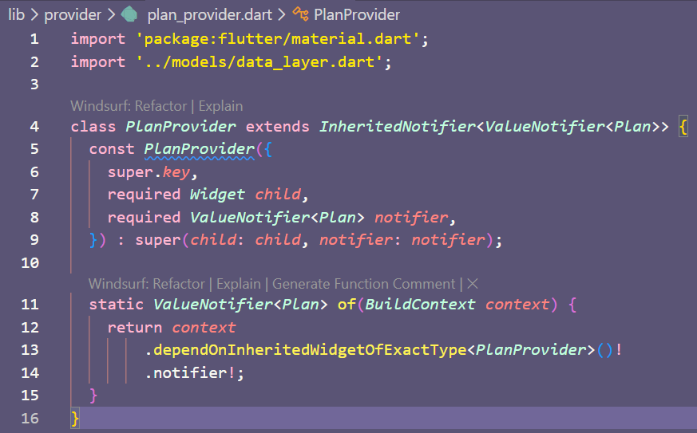

### Langkah 2: Edit main.dart
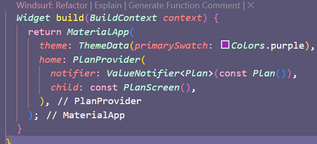

### Langkah 3: Tambah method pada model plan.dart
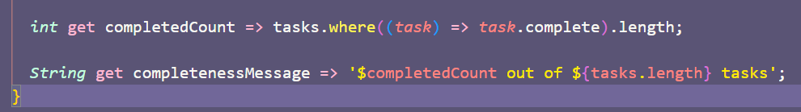

### Langkah 4: Pindah ke PlanScreen (Hapus variabel plan)
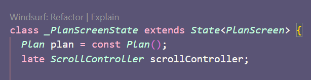

### Langkah 5: Edit method _buildAddTaskButton
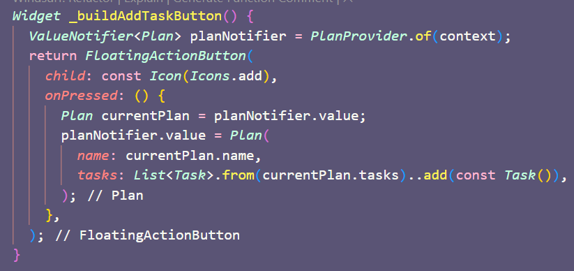

### Langkah 6: Edit widget _buildTaskTile
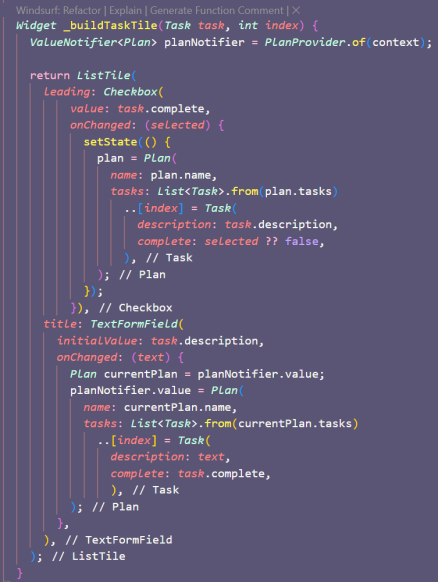

### Langkah 7: Edit _buildList
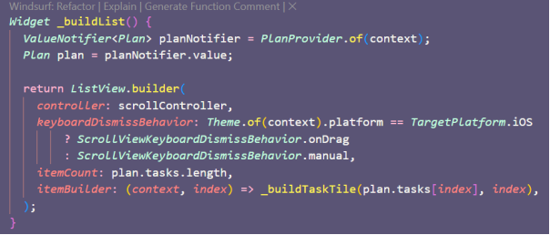

### Langkah 8: Nilai dari plan_screen.dart (Menambah SafeArea)
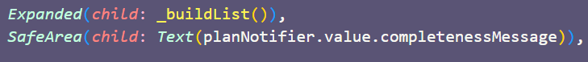
---

## Tugas Praktikum 2

### 1. Selesaikan langkah-langkah praktikum tersebut, lalu dokumentasikan berupa GIF hasil akhir praktikum beserta penjelasannya di file README.md!
**Jawab:** 
 
*Penjelasan: Aplikasi sekarang menggunakan `InheritedWidget` (melalui `PlanProvider`) untuk manajemen state. Tampilan visual mirip dengan Praktikum 1, namun kini terdapat tambahan informasi jumlah tugas yang selesai di bagian bawah layar ("X out of Y tasks").*

### 2. Jelaskan mana yang dimaksud InheritedWidget pada langkah 1 tersebut! Mengapa yang digunakan InheritedNotifier?
**Jawab:** 
* **InheritedWidget**: Pada langkah 1, `PlanProvider` adalah kelas yang mewarisi `InheritedNotifier`. Secara hierarki, `InheritedNotifier` adalah turunan dari `InheritedWidget`.
* **Mengapa InheritedNotifier**: Kita menggunakan `InheritedNotifier` karena ia tidak hanya meneruskan data ke widget turunannya (seperti `InheritedWidget` biasa), tetapi juga memiliki kemampuan untuk mendengarkan perubahan pada objek `Listenable` (dalam hal ini `ValueNotifier`). Ketika nilai pada `ValueNotifier` berubah, `InheritedNotifier` secara otomatis akan memberitahu widget-widget turunannya yang bergantung pada data tersebut untuk melakukan *rebuild*. Ini membuat manajemen state lebih reaktif tanpa perlu memanggil `setState` manual di setiap widget anak.

### 3. Jelaskan maksud dari method di langkah 3 pada praktikum tersebut! Mengapa dilakukan demikian?
**Jawab:** 
Langkah 3 menambahkan dua *getter* pada model `Plan`:
1.  `completedCount`: Menghitung jumlah tugas yang properti `complete`-nya bernilai true.
2.  `completenessMessage`: Mengembalikan String yang berisi status kelengkapan (misal: "2 out of 5 tasks").
**Alasannya:** Ini adalah penerapan prinsip pemisahan *Business Logic* dari *UI Logic*. Perhitungan data sebaiknya dilakukan di dalam Model, bukan di dalam Widget (View). Dengan demikian, kode View menjadi lebih bersih dan logika perhitungan dapat digunakan kembali atau dites dengan mudah.

### 4. Lakukan capture hasil dari Langkah 9 berupa GIF, kemudian jelaskan apa yang telah Anda buat!
**Jawab:** 
*Penjelasan: Saya menambahkan widget `SafeArea` di bagian bawah `Column` pada `PlanScreen`. Widget ini menampilkan `Text` yang mengambil data `completenessMessage` dari `PlanProvider`. Hasilnya, user bisa melihat progres jumlah tugas yang telah diselesaikan secara real-time.*

---

## Praktikum 3: Membuat State di Multiple Screens

### Langkah 1: Edit PlanProvider (Mendukung List<Plan>)
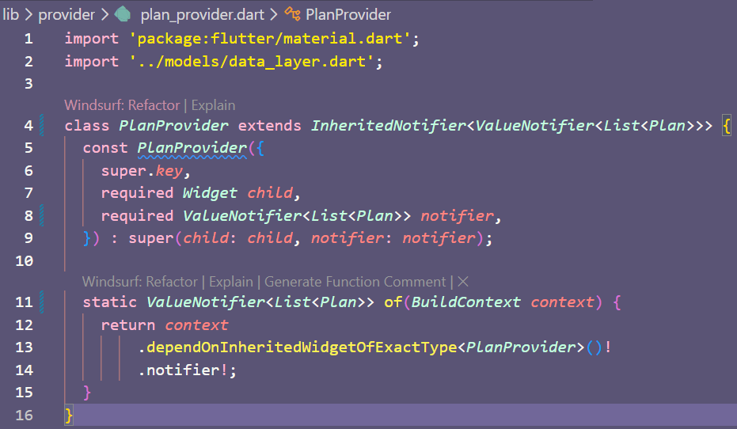

### Langkah 2: Edit main.dart (Menyiapkan List kosong)
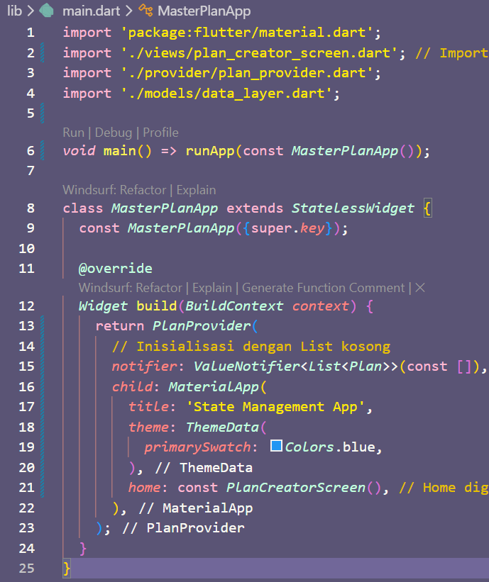

### Langkah 3: Edit plan_screen.dart (Menambahkan planIndex)
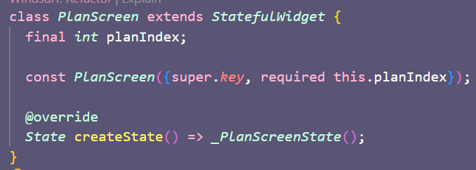

### Langkah 4: Membuat PlanCreatorScreen
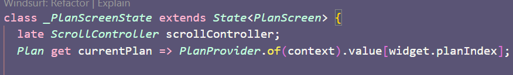

### Langkah 5: Menambahkan Navigasi
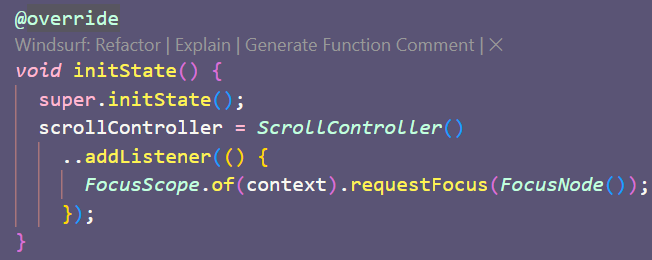

---

## Tugas Praktikum 3

### 1. Selesaikan langkah-langkah praktikum tersebut, lalu dokumentasikan berupa GIF hasil akhir praktikum beserta penjelasannya di file README.md!
**Jawab:** 
*Penjelasan: Aplikasi kini memiliki dua layar. Layar pertama (`PlanCreatorScreen`) untuk membuat dan menampilkan daftar rencana (Plans). Layar kedua (`PlanScreen`) adalah detail dari rencana tersebut di mana user bisa menambah tugas (Tasks). State sekarang mengelola `List<Plan>` sehingga aplikasi dapat menyimpan banyak rencana sekaligus.*

### 2. Berdasarkan Praktikum 3 yang telah Anda lakukan, jelaskan maksud dari gambar diagram berikut ini!
 
**Jawab:** 
Diagram tersebut menggambarkan struktur **Widget Tree** dan **Alur Navigasi** aplikasi setelah perubahan di Praktikum 3:
* **Kiri (PlanCreatorScreen)**: Ini adalah struktur layar awal. Di bawah `MaterialApp`, terdapat `PlanProvider` (sebagai root state management). Di dalam `Column`, terdapat `TextField` untuk input nama plan baru dan `ListView` untuk menampilkan daftar plan yang ada.
* **Panah (Navigator Push)**: Menunjukkan transisi layar. Ketika user mengetuk salah satu item di `ListView`, fungsi `Navigator.push` dipanggil untuk berpindah ke layar detail.
* **Kanan (PlanScreen)**: Ini adalah struktur layar detail. Layar ini juga berada di bawah naungan `PlanProvider` yang sama (karena `PlanProvider` dibungkus di root `main.dart`). `PlanScreen` menampilkan detail tugas dari plan yang dipilih menggunakan `ListView` dan `SafeArea` untuk status kelengkapan.
* Intinya, diagram ini menunjukkan bagaimana `PlanProvider` menyuplai data ke seluruh aplikasi, baik ke layar pembuat plan maupun layar detail plan.

### 3. Lakukan capture hasil dari Langkah 14 berupa GIF, kemudian jelaskan apa yang telah Anda buat!
**Jawab:** 
  
*Penjelasan: Saya telah membuat layar `PlanCreatorScreen` yang berfungsi sebagai "Home". Di sini user bisa memasukkan nama rencana baru. Ketika rencana diklik, aplikasi menavigasi ke `PlanScreen` yang sesuai index-nya. Data antar layar sinkron karena menggunakan satu sumber kebenaran (Single Source of Truth) yaitu `PlanProvider` yang menyimpan `List<Plan>`.*

---
© 2025 Jurusan Teknologi Informasi - Politeknik Negeri Malang