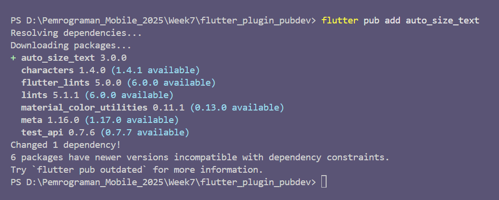
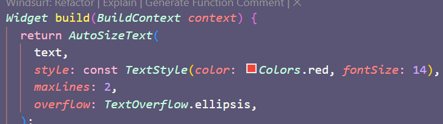
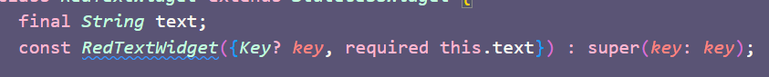
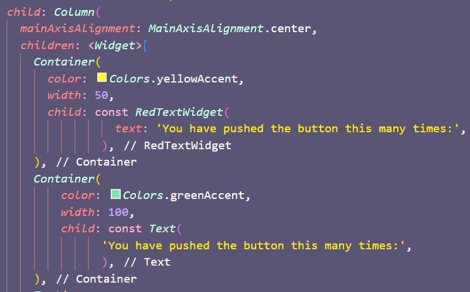
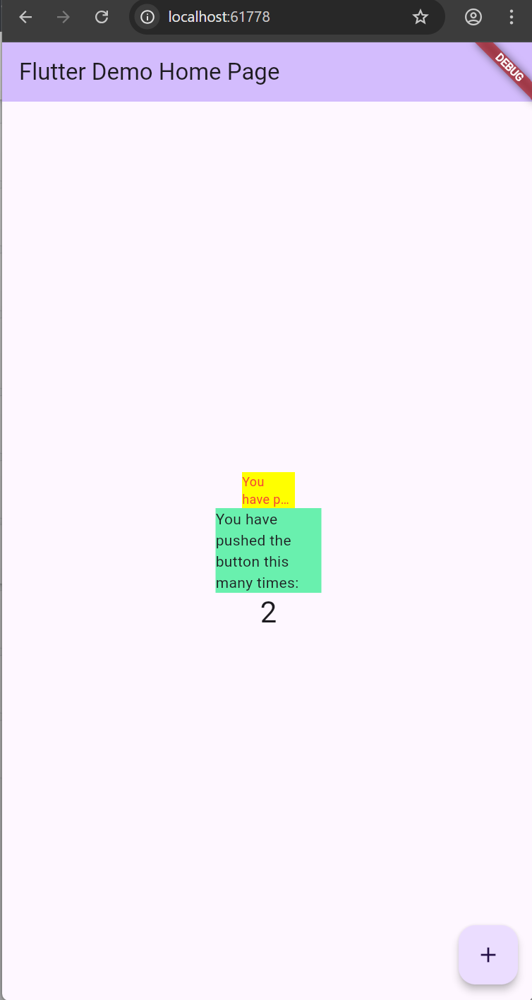

# 📱 Jobsheet 7: Manajemen Plugin

**Mata Kuliah:** Pemrograman Mobile  
**Jurusan:** Teknologi Informasi, Politeknik Negeri Malang  
**Nama:** Octrian Adiluhung Tito Putra  
**NIM:** 2341720078  
**Kelas:** TI - 3E  
**Absen:** 23  

---

## Langkah 2: Menambahkan Plugin

### Output:

---

## Langkah 3: Buat file red_text_widget.dart

### Output:

---

## Langkah 4: Tambah Widget AutoSizeText

### Output:

---

## Langkah 5: Buat Variabel text dan parameter di constructor

### Output:

---

## Langkah 6: Tambahkan widget di main.dart

### Output:

---
## Hasil: Tampilan Aplikasi

### Output:

---

## Tugas Praktikum

### 1. Selesaikan Praktikum tersebut, lalu dokumentasikan dan push ke repository Anda berupa screenshot hasil pekerjaan beserta penjelasannya di file README.md!

### 2. Jelaskan maksud dari langkah 2 pada praktikum tersebut!

Langkah 2 (`flutter pub add auto_size_text`) bertujuan untuk menambahkan dependensi (plugin) `auto_size_text` ke project Flutter. Plugin ini menyediakan widget `AutoSizeText` yang secara otomatis menyesuaikan ukuran font teks agar muat di ruang yang tersedia dan mencegah overflow.

---

### 3. Jelaskan maksud dari langkah 5 pada praktikum tersebut!

Langkah 5 bertujuan untuk membuat widget `RedTextWidget` dapat menerima data dari luar.

* Didefinisikan variabel `final String text;` untuk menampung data teks.
* Constructor dibuat dengan `required this.text` untuk memastikan setiap kali widget ini digunakan, ia wajib diberi input nilai teks.

---

### 4. Pada langkah 6 terdapat dua widget yang ditambahkan, jelaskan fungsi dan perbedaannya!

Pada langkah 6, terdapat dua widget teks di dalam dua `Container`:

| Fitur | Widget Pertama (Kuning, Lebar 50) | Widget Kedua (Hijau, Lebar 100) |
| :--- | :--- | :--- |
| Widget Teks | `RedTextWidget` (menggunakan `AutoSizeText`) | `Text` (Widget bawaan Flutter) |
| Fungsi Kunci | Menyesuaikan ukuran font secara otomatis agar teks muat dalam lebar 50. | Menampilkan teks dengan ukuran font statis (tidak mengecil otomatis). Teks akan mengalami overflow atau terpotong jika tidak muat. |

---

### 5. Jelaskan maksud dari tiap parameter yang ada di dalam plugin `auto_size_text` berdasarkan tautan pada dokumentasi ini!

Berdasarkan penggunaan di Langkah 4 (`AutoSizeText(text, style, maxLines, overflow)`):

| Parameter | Fungsi |
| :--- | :--- |
| `text` | Teks yang akan ditampilkan. (Wajib) |
| `style` | Gaya visual teks. Nilai `fontSize` di dalamnya berfungsi sebagai ukuran font maksimum yang diizinkan. |
| `maxLines` | Jumlah baris maksimum yang diizinkan sebelum teks dipotong. |
| `overflow` | Cara menangani teks yang tidak muat (walaupun font sudah terkecil). Nilai `TextOverflow.ellipsis` menambahkan tiga titik (`...`) di akhir. |
| minFontSize | (Parameter Penting Lain) Ukuran font minimum yang akan dicoba oleh widget. Teks tidak akan lebih kecil dari nilai ini. |

### 6. Kumpulkan laporan praktikum Anda berupa link repository GitHub kepada dosen!

---

© 2025 Jurusan Teknologi Informasi - Politeknik Negeri Malang

---
