# Jobsheet 9: Kamera di Flutter

**Mata Kuliah:** Pemrograman Mobile  
**Jurusan:** Teknologi Informasi, Politeknik Negeri Malang  
**Nama:** Octrian Adiluhung Tito Putra  
**NIM:** 2341720078  
**Kelas:** TI - 3E  
**Absen:** 23  

---

## Praktikum 1: Mengambil Foto dengan Kamera

### Langkah 3: Ambil Sensor Kamera dari device
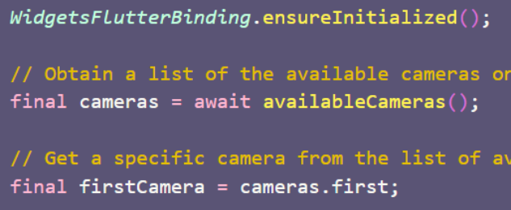

---

### Langkah 4: Buat dan inisialisasi CameraController
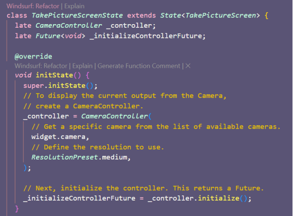

---

### Langkah 5: Gunakan CameraPreview untuk menampilkan preview foto
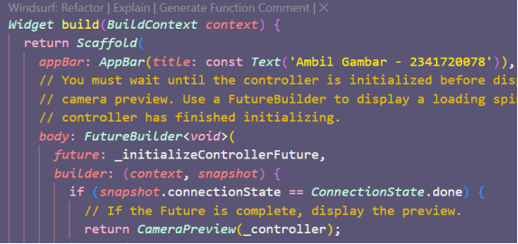

---

### Langkah 6: Ambil foto dengan CameraController
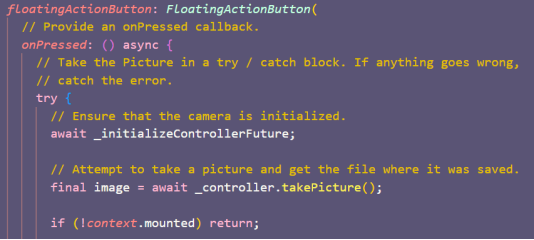

---

### Langkah 7: Buat widget baru DisplayPictureScreen
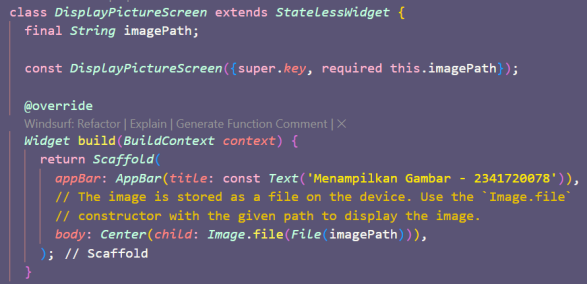

---

### Langkah 8: Edit main.dart
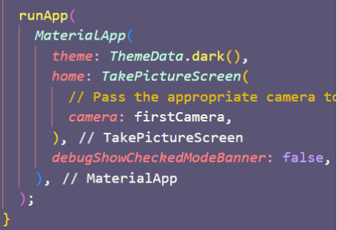

---

### Langkah 9: Menampilkan hasil foto
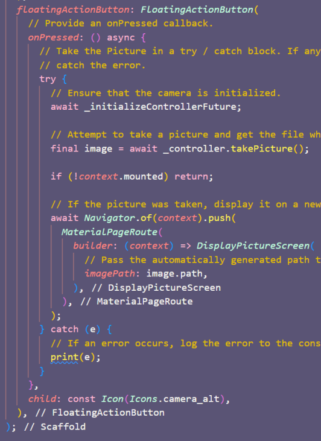

---

### Hasil Praktikum 1
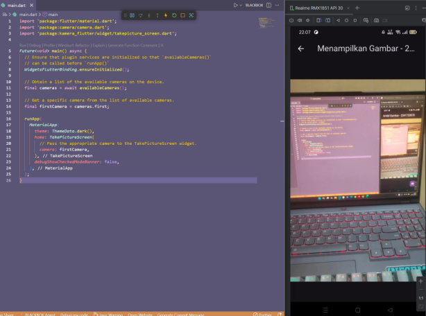

---

## Praktikum 2: Membuat Photo Filter Carousel

### Langkah 2: Buat widget Selector ring dan dark gradient
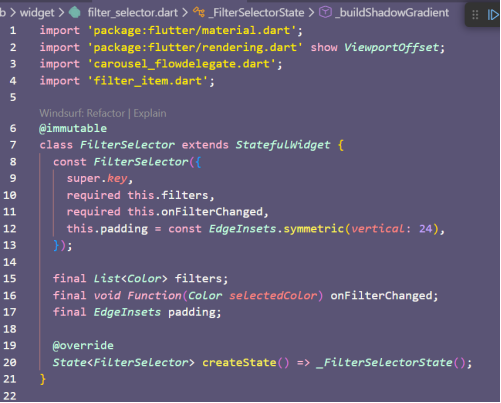

---

### Langkah 3: Buat widget photo filter carousel
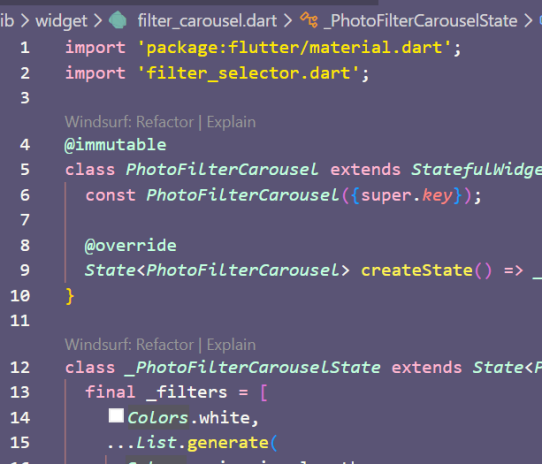

---

### Langkah 4: Membuat filter warna - bagian 1
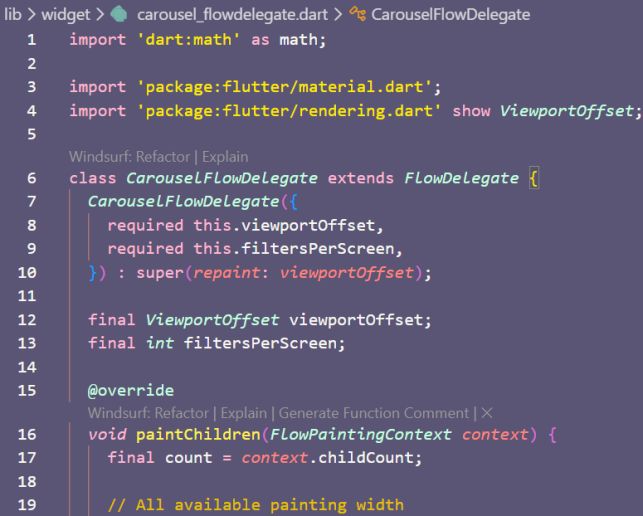

---

### Langkah 5: Membuat filter warna
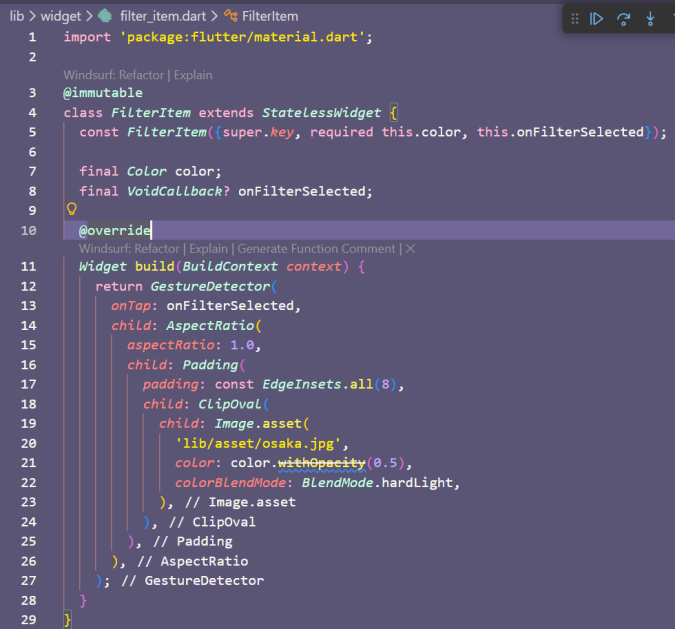

---

### Langkah 6: Implementasi filter carousel
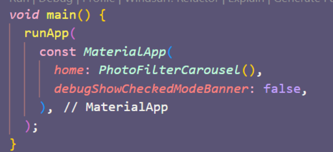

---

### Hasil Praktikum 2
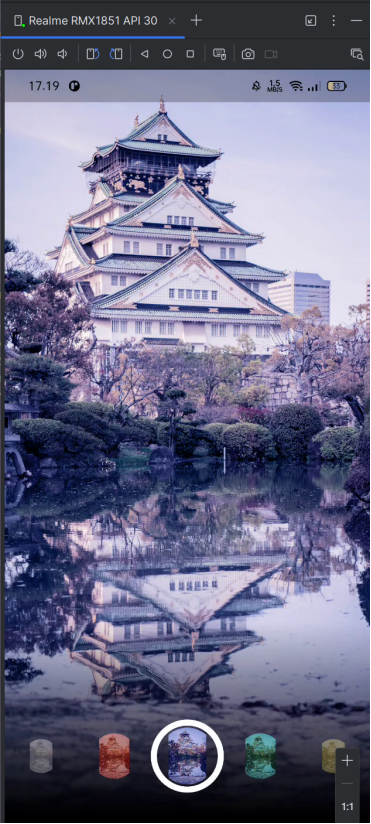

---

## Tugas Praktikum

### 1. Gabungkan hasil praktikum 1 dengan hasil praktikum 2 sehingga setelah melakukan pengambilan foto, dapat dibuat filter carouselnya!

**Hasil Penggabungan:**
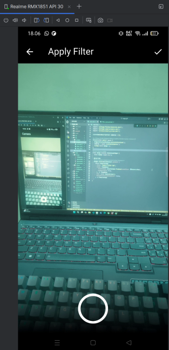

---

### 2. Jelaskan maksud `void async` pada praktikum 1?

Maksud dari `void async` (atau `Future<void> ... async`) pada praktikum tersebut adalah mendefinisikan fungsi yang tidak mengembalikan nilai namun berjalan secara asinkron. Hal ini memungkinkan penggunaan kata kunci `await` di dalamnya untuk menunda eksekusi aplikasi hingga proses inisialisasi daftar kamera (`availableCameras()`) benar-benar selesai sebelum aplikasi dijalankan.

---

### 3. Jelaskan fungsi dari anotasi `@immutable` dan `@override` ?

* **`@immutable`**: Anotasi ini menandai bahwa sebuah kelas (*class*) bersifat tidak dapat diubah setelah objeknya dibuat. Artinya, semua variabel (*field*) di dalam kelas tersebut harus bersifat `final`. Dalam Flutter, ini sangat penting untuk `Widget` guna memastikan efisiensi performa saat proses *rebuild* UI.
* **`@override`**: Anotasi ini memberi tahu *compiler* bahwa metode yang ditulis di bawahnya bertujuan untuk menggantikan atau menulis ulang metode yang diwariskan dari kelas induk (*parent class*). Hal ini membantu mendeteksi kesalahan (seperti *typo*) jika nama metode tidak sesuai dengan yang ada di kelas induk.

---

© 2025 Jurusan Teknologi Informasi - Politeknik Negeri Malang